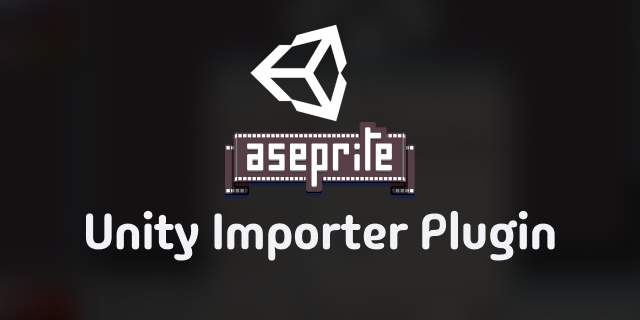

# Unity Importer Plugin for Unity

[](https://github.com/soupmasters/UnityImporterPluginForUnity/actions/workflows/ci.yml)
[](https://github.com/soupmasters/UnityImporterPluginForUnity/releases/latest)
[](https://github.com/soupmasters/UnityImporterPluginForUnity/releases)
[](LICENSE)

Aseprite extension for authoring Unity animation events directly in the timeline.

Created and maintained by Martin Calander.

## Installation

The recommended way to install this extension is with [Aseprite Extension Manager](https://github.com/soupmasters/AsepriteExtensionManager):

1. Choose **Install from GitHub** in Extension Manager.
2. Paste this Git URL:

   ```text
   https://github.com/soupmasters/UnityImporterPluginForUnity.git
   ```

3. Confirm the installation.

For a direct installation, download the `.aseprite-extension` file from the [latest release](https://github.com/soupmasters/UnityImporterPluginForUnity/releases/latest), open it with Aseprite, and confirm the installation prompt.

Restart Aseprite or rescan the Scripts folder if the commands are not visible immediately.

Unity importer notices require Aseprite 1.3.15 or newer.

## Features

- Managed `Events` layer with enforced structure for consistent exports.
- Event cels stored as `event:@NAME` in cel data.
- Add/remove events from cel and frame popup menus.
- Double-click event editing on the `Events` layer.
- Non-modal live settings panel for marker color and behavior controls.
- Whole-file import command to convert timeline tags like `@PUNCH` into Unity Animation Events at tag start frame.
- Whole-file duplicate tag analyzer that can auto-rename duplicates to unique names with ` (1)`, ` (2)` suffixes.
- Migration command to convert legacy `event:MyMethod` entries to current `event:@MyMethod` format.
- Layer context action `Dont Import to Unity` that marks layer metadata as `DontImportToUnity` and dims the layer.
- Status-bar notice when the current `.ase` or `.aseprite` asset is handled by Unity's 2D Aseprite Importer.
- Multilingual UI support with auto language detection.

## Language Support

The extension UI supports:

- English (`en`)
- Spanish (`es`)
- Swedish (`sv`)
- French (`fr`)
- German (`de`)
- Portuguese (`pt`)
- Auto mode (reads Aseprite UI language)

Language is configurable in `File > Scripts > Unity Importer Plugin for Unity Settings`.

## Default Shortcuts (`my_keys`)

- `Ctrl+Alt+E`: Add Unity Animation Event
- `Ctrl+Alt+D`: Edit Unity Animation Event
- `Ctrl+Alt+R`: Remove Unity Animation Event
- `Ctrl+Alt+I`: Import `@Tags` to Unity Animation Events (whole file)
- `Ctrl+Alt+U`: Analyze duplicate tags and rename to unique
- `Ctrl+Alt+M`: Migrate `event:MyMethod` to current format
- `Ctrl+Alt+S`: Unity Importer Plugin for Unity Settings

## Notes

- Double-click editing only applies to the managed `Events` layer.
- Event layer integrity is automatically enforced (name, lock state, visibility, top-level placement).
- Opening properties on a `DontImportToUnity` layer prompts to allow Unity import again (clears metadata and restores full opacity).
- Existing event data without the `event:@` prefix is normalized automatically.
- Importer detection requires a sibling `.meta` sidecar and the `com.unity.2d.aseprite` package in the containing project.
- Aseprite may request permission to read the Unity project's package metadata when it first detects a matching asset.

## Development

There is no build step. Edit `celcolor.lua` directly and keep `package.json`, `my_keys.aseprite-keys`, and the Lua source together at the extension root. Aseprite-generated installation metadata and user preferences are intentionally excluded from the repository.

## License

Released under the [MIT License](LICENSE).
